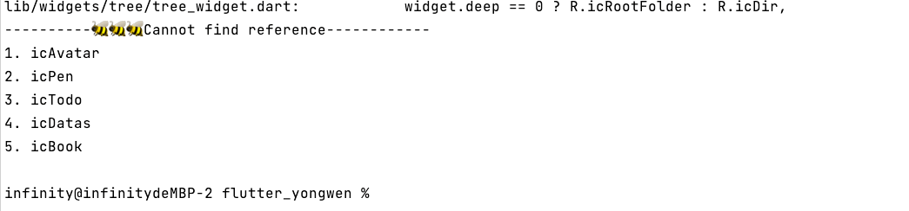

A sample command-line application with an entrypoint in `bin/`, library code in `lib/`, and example
unit test in `test/`.

# 检测索引R.dart文件

> 执行检测工程目录下的R.dart的资源文件相关的文件是否被引用，最后会显示出没被引用的数据

## 执行如下命令:

```shellscript
sh scripts/lint_resource.sh lib/res/r.dart lib
```

## 执行结果如下:

```
infinity@infinitydeMBP-2 flutter_yongwen % sh scripts/lint_resource.sh lib/res/r.dart lib
$ grep -r R.icCry lib
lib/widgets/empty_widget.dart:        Imagex.asset(R.icCry, width: 200, height: 200, color: context.primaryColor),
$ grep -r R.icAvatar lib
ShellException(grep -r R.icAvatar lib, exitCode 1, workingDirectory: /Users/infinity/Code/githubs/flutter_yongwen)
$ grep -r R.icHistory lib
lib/page/infos/main_page.dart:                                  asset: R.icHistory,
lib/widgets/filewidgets/file_preview_icon.dart:      return Imagex.asset(R.icHistory, width: 20, height: 20, color: context.primaryColor);
$ grep -r R.icPen lib
ShellException(grep -r R.icPen lib, exitCode 1, workingDirectory: /Users/infinity/Code/githubs/flutter_yongwen)
$ grep -r R.icTodo lib
ShellException(grep -r R.icTodo lib, exitCode 1, workingDirectory: /Users/infinity/Code/githubs/flutter_yongwen)
$ grep -r R.icDatas lib
ShellException(grep -r R.icDatas lib, exitCode 1, workingDirectory: /Users/infinity/Code/githubs/flutter_yongwen)
$ grep -r R.icSetting lib
lib/page/infos/main_page.dart:                                  asset: R.icSetting,
lib/widgets/filewidgets/file_preview_icon.dart:      return Imagex.asset(R.icSetting, width: 20, height: 20, color: context.primaryColor);
$ grep -r R.icCalender lib
lib/page/infos/main_page.dart:                                  asset: R.icCalender,
lib/widgets/filewidgets/file_preview_icon.dart:      return Imagex.asset(R.icCalender, width: 20, height: 20, color: context.primaryColor);
$ grep -r R.icFavorite lib
lib/page/infos/main_page.dart:                                  asset: R.icFavorite,
$ grep -r R.icDir lib
lib/page/infos/main_page.dart:                                  asset: R.icDir,
lib/page/infos/widgets/tree/tree_collect_widget.dart:            widget.deep == 0 ? R.icRootFolder : R.icDir,
lib/widgets/tree/tree_select_widget.dart:            widget.deep == 0 ? R.icRootFolder : R.icDir,
lib/widgets/tree/tree_widget.dart:            widget.deep == 0 ? R.icRootFolder : R.icDir,
$ grep -r R.icBook lib
ShellException(grep -r R.icBook lib, exitCode 1, workingDirectory: /Users/infinity/Code/githubs/flutter_yongwen)
$ grep -r R.icFile lib
lib/widgets/filewidgets/file_preview_icon.dart:          Imagex.asset(R.icFile, width: width ?? size, height: height ?? size, color: context.primaryColor),
$ grep -r R.icOpenFolder lib
lib/page/infos/widgets/panels/collect_sentence_panel.dart:              child: Imagex.asset(R.icOpenFolder, width: 20, height: 20, color: context.primaryColor),
lib/page/infos/widgets/panels/file_panel.dart:              child: Imagex.asset(R.icOpenFolder, width: 20, height: 20, color: context.primaryColor),
$ grep -r R.icRootFolder lib
lib/page/infos/widgets/tree/tree_collect_widget.dart:            widget.deep == 0 ? R.icRootFolder : R.icDir,
lib/widgets/tree/tree_select_widget.dart:            widget.deep == 0 ? R.icRootFolder : R.icDir,
lib/widgets/tree/tree_widget.dart:            widget.deep == 0 ? R.icRootFolder : R.icDir,
----------🐝🐝🐝Cannot find reference------------
1. icAvatar
2. icPen
3. icTodo
4. icDatas
5. icBook
```

可以看到最后显示出没有被引用到的图片文件：
